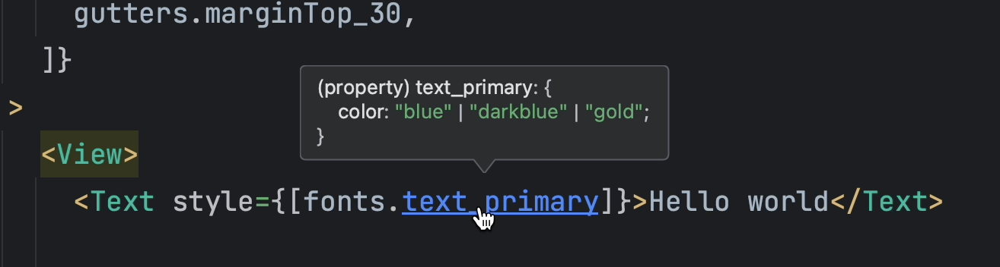

After using the boilerplate on several projects, 
we decided to revisit some important aspects while still adhering to the core principles of the boilerplate: 
separation of concerns, ease of setup, and maintainability. 
We made several enhancements, which we'll detail here.

<!--truncate-->


## Improved Theming
Theming is a crucial aspect of any application. 
Previously, we had designed a layered theming system where all variables could be customized for each theme, 
including base colors and spacing. 
Upon reflection, we found that this system, while effective, wasn't the most straightforward to use, 
especially with the layered naming convention.

Additionally, being able to modify spacing between themes didn't make sense. 
Furthermore, the variable names we used weren't always intuitive. 
For instance, terms like 'medium' or 'large' didn't allow for easy interpolation between them. 
It was even harder to find an intermediate value between 'medium' and 'regular,' for example.

As a result, we decided to simplify and improve the theming process, making it more efficient and comprehensive.

### Configuration
Everything now revolves around a configuration file named `_config.ts`. 
This file serves as a central configuration point where you can define the base theme values and declare theme variants. 
We've moved away from the complex layering system in favor of a more reflective system with main themes and variants.

### Theme Provider
To boost performance, we introduced a `ThemeProvider` component. This component provides the theme to the application, 
preventing the need to regenerate the theme with every `useTheme` call.

### Type Inference
We've also improved the type inference of the theme. Now each generated style is typed according to the theme configuration even if there are variants.
For example, let's imagine a configuration like this:

```ts title=/src/theme/_config.ts
export const config = {
    //...
    fonts: {
        //...
        colors: {
            primary: 'blue',
        },
    },
    //...
    variants: {
        dark: {
            fonts: {
                colors: {
                    primary: 'darkblue',
                },
            },
        },
        premium: {
            fonts: {
                colors: {
                    primary: 'gold',
                },
            },
        }
    }
}
```

The generated type will be inferred at the perfect level:



## Goodbye Redux 🤧
Redux is a fantastic library, but it's not always the best solution for every project.
When we started the boilerplate, our goal was to provide a comprehensive solution for state management. In our initial version, we integrated Redux, Redux Persist, and Redux Saga, to name a few. These libraries were essential for managing the application's state, handling asynchronous requests, and persisting data.

However, over time, alternative solutions emerged, 
particularly in the realm of data fetching. 
It was with Redux Toolkit Query that we began version 3. 
Nonetheless, we decided to part ways with it for version 4.

Our aim has always been to offer a lightweight yet comprehensive solution 
without being too opinionated. Thus, we chose to remove Redux from the boilerplate 
in favor of lighter and more straightforward alternatives. 
It's important to note that global state management remains crucial in an application, 
and several options are available:

- Redux
- Mobx
- Zustand
- Jotai
- React Context
- And more...

Now, in this version, for data fetching, we now use React Query, 
an excellent library that's straightforward to use. 
As for data storage, we rely on React Native MMKV, a native library known for its high performance and secure, 
synchronous data storage capabilities.

## Enhanced Documentation 💙
We also took the opportunity to enhance the documentation. 
It's now clearer and more comprehensive. 
We've made an effort to make the documentation more accessible and easier to understand. 
At times, we've added 'playgrounds' in the section related to theme generation, 
allowing you to directly test the values you want and see the results for yourself
