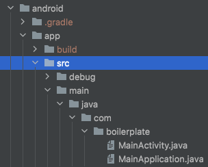

🚧 It's a Work In Progress section 🚧

# Distributing beta builds

Developers love writing React Native code but no one likes deploying React Native app or distributing beta builds.  

All your headaches will disappear with this documentation and the amazing [Fastlane](https://fastlane.tools/) tool :)

## Before you start

You need a Mac. I'm sorry, but if you are a Windows user, you can stop reading right now.  
Fastlane will not work on Windows PC. But in all cases, if you need to deploy your app on IOS, you must have a Mac.

Let's explain which tools we are using to distribute beta builds:
* [Fastlane](https://fastlane.tools/), the easiest way to automate beta deployments and releases for your iOS and Android apps. It handles all tedious tasks like generating screenshots, dealing with code signing and releasing your application.
* [TestFlight](https://developer.apple.com/testflight/), part of App Store Connect, let you build your iOS app and invite internal or external users to test it
* [Google Play](https://support.google.com/googleplay/android-developer/answer/3131213?hl=fr), which does the same job as TestFlight for Android apps

## Installing Fastlane

First you need to install Fastlane on your Mac. Follow these steps:

1. Install the latest Xcode command line tools:
```
$ xcode-select --install
```
2. Install Ruby using [Homebrew](https://brew.sh/):
```
$ brew install ruby
```
3. Install Fastlane with RubyGems:
```
$ sudo gem install fastlane -NV
```

 You are now ready to set up Fastlane for iOS and Android :rocket:


## iOS

### Prerequisites

Before continuing make sure you have:

- [ ] Install all [required dependencies](https://facebook.github.io/react-native/docs/getting-started.html#installing-dependencies), with Xcode 9 or higher
- [ ] Choose the [bundle identifier](https://cocoacasts.com/what-are-app-ids-and-bundle-identifiers/) of your app (for example `com.tcm.boilerplate`)
- [ ] An Apple ID with an admin user, with its username (email, for example `dev-team@yourcompany.com`) and password
- [ ] Your app name, if not already created on the Developer Portal (for example `TCM React Native Boilerplate`). Fastlane can create applications in the Developer Portal and App Store Connect, so it's recommended to let Fastlane do the job for you.
- [ ] Use the right [.gitignore](https://github.com/thecodingmachine/react-native-boilerplate/blob/master/template/ios/.gitignore) file inside the `ios` directory
- [ ] You also need to create an App Icon to use Fastlane or you will get an error on running `fastlane beta`. You can simply create one using the website [MakeAppIcon](https://makeappicon.com/)

Open your Xcode project and modify some information:

- [ ] In the `General` tab, `Identity` section, change the `Bundle Identifier` to your identifier (useful for Fastlane)
- [ ] In the `Signing & Capabilities` tab, `Signing` section, disable `Automatically manage signing`
- [ ] In the `Build Settings` tab, set view filter on top to `All` and `Combined`, then go to the `Signing` section and into `Code Signing Identity`, set `Apple Development` for the `debug` line (including `Any iOS SDK` also) and set `Apple Distribution` for the `release` line (including `Any iOS SDK` also).


Like this:

| Code Signing Identity  | < Multiple values > |
| ------------- | ------------- |
| Debug  | Apple Development  |
| Any iOS SDK  | Apple Development  |
| Release  | Apple Distribution  |
| Any iOS SDK  | Apple Distribution  |


### Setting up

First you need to set up Fastlane for your iOS project:
```
$ cd my-project/ios
$ fastlane init
```

*Note: If you have an error on this step, please see the `issues` section.*


Fastlane will automatically detect your project and ask for any missing information.

The following questions will be asked:
* `What would you like to use fastlane for?`
  * For this tutorial a good answer is `2 - Automate beta distribution to TestFlight`
* `Select Scheme:`
  * Here we will select the scheme without `-tvOS` suffix
* `Apple ID Username:`
  * If you don't know, you didn't read the "Prerequisites" step :)  
  Our answer is `dev-team@yourcompany.com`
* `Password (for Apple ID Username):`
  * If you don't know, you didn't read the "Prerequisites" step :)  
  Our answer is `keep it secret`

* If your account has multiple teams in the App Store Connect, you may have this question: `Multiple App Store Connect teams found, please enter the number of the team you want to use:`
  * Select the right team
* If your account has multiple teams in the Developer Portal, you may have this question: `Multiple teams found on the Developer Portal, please enter the number of the team you want to use:`
  * Select the right team
* If you haven't already created the App on the Developer Portal or App Store Connect, Fastlane can do it for you! (else you must have a message `Your app 'com.tcm.boilerplate' is available in your Apple Developer Portal / App Store Connect`)
  * It will ask `Do you want fastlane to create the App ID for you on the Apple Developer Portal / App Store Connect? (y/n)`
    * Type `y`
  * `App Name`:
    * `TCM React Native Boilerplate`

Fastlane will then give you some information about git, the files it will create, etc. Just type `enter` to continue.

**Congrats!** Fastlane has created some files.  

If you are using Git, commit all generated files.

Once the setup has finished you can see a new folder inside the `ios` folder:
```
 - fastlane/
   - Appfile
   - Fastfile
```

It's not finish, you need to follow `Code Signing` part to setting up a provisioning profile.

For information:

`Appfile` contains identifiers used to connect to the Developer Portal and App Store Connect.
You can read more about this file [here](https://docs.fastlane.tools/advanced/#appfile).

`Fastfile` contains all actions you can launch.
You can read more about this file [here](https://docs.fastlane.tools/actions).
Because we previously chose `Automate beta distribution to TestFlight` on set up, a `beta` [lane](https://docs.fastlane.tools/advanced/lanes/) is available by default.
This `lane` contains 3 actions:
* increment the build number of your app
* build your app
* upload to TestFlight


### Code signing

Signing your app assures users that it is from a known source and the app hasn’t been modified since it was last signed. Before your app can integrate app services, be installed on a device, or be submitted to the App Store, it must be signed with a certificate issued by Apple.

A full guide is available on the fastlane doc, describing the best approaches for your [code signing process](https://docs.fastlane.tools/codesigning/getting-started/).

Using `match` is probably [the best solution](https://codesigning.guide/).  
Because we don't want to revoke our existing certificates, but still want an automated setup, we will use [cert and sigh](https://docs.fastlane.tools/codesigning/getting-started/#using-cert-and-sigh).

Add the following lines to your `Fastfile`, just after the `increment_build_number` function and before `build_app` (Note that you will need to replace some information):
```
    get_certificates( # Create or get certificate, and install it
      output_path: "./builds" # Download certificate in the build folder (you don't need to create the folder)
    )
    get_provisioning_profile( # Create or get provisioning profile
      output_path: "./builds",  # Download provisioning profile in the build folder
      filename: "provisioning.mobileprovision" # Rename the local provisioning profile
    )
    update_project_provisioning( # Set the project provisioning profile (related in Xcode to the General > Signing Release section)
      xcodeproj: "Boilerplate.xcodeproj",
      target_filter: "Boilerplate", # Name of your project
      profile: "./builds/provisioning.mobileprovision",
      build_configuration: "Release"
    )
    update_project_team( # Set the right team on your project
      teamid: CredentialsManager::AppfileConfig.try_fetch_value(:team_id)
    )
```

Then, we need to configure the provisioning profile for the build step.

Add the following lines to your `Fastfile`, inside the `build_app` function, just after the `scheme` parameter (Make sure you add a `,` after the `scheme` parameter):
```
    clean: true,
    export_method: "app-store",
    export_options: {
      provisioningProfiles: {
          CredentialsManager::AppfileConfig.try_fetch_value(:app_identifier) => CredentialsManager::AppfileConfig.try_fetch_value(:app_identifier) + " AppStore" # Value of this parameter is the name of the Provisioning Profile. By default, it will be "{bundleId} AppStore"
      }
    },
    build_path: "./builds",
    output_directory: "./builds"
```

Thanks to this the Certificates and Provisioning Profile will be automatically created when you will create a beta build!  
:rocket: You are now ready to create your first beta build.


### Creating a beta build

Creating a beta build and uploading it on TestFlight is now really easy.  
Just type the following:

```
$ cd my-project/ios
$ fastlane beta
```


## Android

### Prerequisites

Before continuing make sure you have:

- [ ] A Google Play Console *admin* account and its username (email, for example `dev-team@yourcompany.com`) and password
- [ ] Create your application in the Google Play Console (unlike for iOS Fastlane cannot do that for you)
- [ ] Use the right [.gitignore](https://github.com/thecodingmachine/react-native-boilerplate/blob/master/template/android/.gitignore) file inside the `android` directory (if you are using this boilerplate you are good to go)
- [ ] [Collect your Google Credentials](https://docs.fastlane.tools/getting-started/android/setup/#collect-your-google-credentials)  
    :warning: In the Google Play Console, add the parameter `&hl=en` at the end of the URL (before any #) to switch to English. In some languages, the "Create Service Account" will not be available.
    Download the JSON key file, and copy it into `my-project/android/key.json`
- [ ] Install [all dependencies](https://facebook.github.io/react-native/docs/getting-started.html#installing-dependencies-1) for macOS and Android


### Setting up

First you need to set up Fastlane for your android project:
```
$ cd my-project/android
$ fastlane init
```

Fastlane will automatically detect your project and ask for any missing information.

The following questions will be asked:
* `Package Name (com.krausefx.app)`
  * Our answer is `com.tcm.boilerplate`. Be careful, do not use dashes (-) in your package name.
* `Path to the json secret file`
  * Type `key.json` (path to the file previously created in the Prerequisites step)
* Download existing metadata and setup metadata management?
  * `y`

Fastlane will then give you some information about git, the files it will create, etc. Just type `enter` to continue.

Congrats! Fastlane has created some files.  
If you are using Git, commit all generated files.

Once the setup has finished you can see a new folder inside the `android` folder:
```
 - fastlane/
   - Appfile
   - Fastfile
```

`Appfile` contains identifiers used to connect to the Google Play Console and the link to the `key.json` file.  
You can read more about this file [here](https://docs.fastlane.tools/advanced/#appfile).

`Fastfile` contains all actions you can launch.
You can read more about this file [here](https://docs.fastlane.tools/actions).  
A `beta [lane](https://docs.fastlane.tools/advanced/lanes/)`, a `deploy lane` and a `test lane` are available by default.  

You can remove the `deploy lane` to avoid some mistakes, and replace the `beta` lane by the following:
```
  desc "Submit a new Beta Build to Play Store"
  lane :beta do
    store_password = prompt(text: "Signing Store Password: ", secure_text: true)
    key_password = prompt(text: "Alias Key Password: ", secure_text: true)
    releaseFilePath = File.join(Dir.pwd, "..", "my-release-key.keystore")
    gradle(task: 'clean')
    gradle(
      task: 'bundle',
      build_type: 'Release',
      print_command: false,
      properties: {
        "android.injected.signing.store.file" => releaseFilePath,
        "android.injected.signing.store.password" => store_password,
        "android.injected.signing.key.alias" => "my-key-alias",
        "android.injected.signing.key.password" => key_password,
      }
    )
    upload_to_play_store(
      track: 'internal'
    )
```

As you can see, we need to sign our APK with a signing key.
Don't worry, we will generate it in a moment, let's just explain what the lane do.

First, script ask the user two values : signing store and alias key passwords, with the [`prompt`](https://docs.fastlane.tools/actions/prompt/) fastlane plugin.
Asking the user those passwords ensure that no secret keys are stored into your app.  
Then, this lane clean your project, assemble the application, automatically injecting signing configuration at runtime, before uploading it in the Google Play Store.  
Upload is made `internally`, that means only internal testers will be allowed to download the app. You can learn more about different test types [here](https://support.google.com/googleplay/android-developer/answer/3131213).


#### Generating a signing key

[Official documentation](https://facebook.github.io/react-native/docs/signed-apk-android#generating-a-signing-key) well explained how to generate a signing key.

You simply need to run the following :
```bash
keytool -genkey -v -keystore my-release-key.keystore -alias my-key-alias -keyalg RSA -keysize 2048 -validity 10000
```
This command prompts you for passwords for the keystore and key and for the Distinguished Name fields for your key.  
It then generates the keystore as a file called `my-release-key.keystore`

Note: Remember to keep your keystore file private and never commit it to version control.

Copy the generated `my-release-key.keystore` file into the root of `android` folder.

You're now good to build and deploy !


### Creating a beta build

:warning: The first time you deploy your application, you MUST upload it into Google Play Console `manually`.
Google don't allow to use theirs APIs for the first upload.  
To do this, comment the three last lines of the `Fastfile`
```
#upload_to_play_store(
#      track: 'internal'
#    )
```
or create a new lane without those lines.

:exclamation: There is no official plugin to automatically upgrade android version code (unlike the iOS lane).  
Before each deployment, be sure to `manually` upgrade the `versionCode` value inside `android/app/build.gradle`.  
We are working on an automatic way to do this.  

Creating a beta build and uploading it on Google Play is now really easy.  
Just type the following:

```
$ cd my-project/android
$ fastlane beta
```


## Troubleshooting

### Stuck at `bundle install` or `bundle update` running `fastlane init`

If the `fastlane init` process is stuck when running `bundle install` or `bundle update` it may mean that `bundle` command is asking for root permissions.  
You can stop the process and retry again with `sudo fastlane init`, however you will need to change back ownership of the generated files to your user when it finishes by running this command:
```
$ sudo chown <your-user> <files>
```

### Permission denied running android beta lane

If you have a `Permission denied` issue on an android beta build, please run:
```
$ chmod a+x /my-project/android/gradlew
```

### Fastlane init failed
```
fastlane init failed
["The request could not be completed because:", "Could not receive latest API key from App Store Connect, this might be a server issue."]
Something failed while running `fastlane init`
Tried using Apple ID with email 'dev-team@yourcompany.com'
You can either retry, or fallback to manual setup which will create a basic Fastfile
Would you like to fallback to a manual Fastfile? (y/n)
```
Answer `n`, and retry previous steps with a correct Apple ID and password.  
Make sure you are connected to internet.

### Execution failed for task ':app:packageRelease'. (Android)
Make sure the tree structure is equivalent to the android app id.
In this example, the app id will be com.boilerplate:
, 

Of course, after choosing your app id, you can update the tree structure and make sure `MainActivity.java` and `MainApplication.java` contain the right package name (first line of the file).

---
If you need more informations, don't hesitate to read the [fastlane documentation](https://docs.fastlane.tools/)
